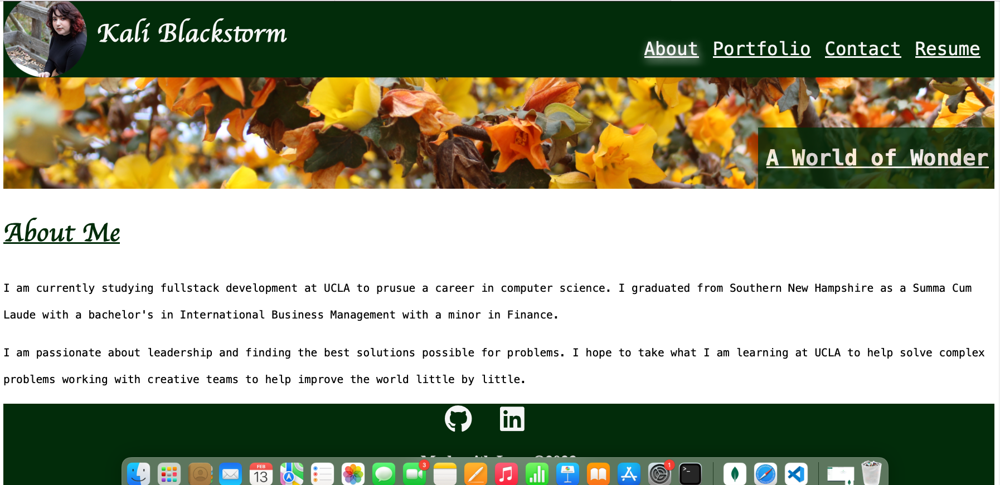

# my-portfolio-with-react
This portfolio uses react to render the DOM

## Description

This react portfolio is meant to highlight my projects, in an easy to update format and more user friendly way than a static portfolio only made with HTML and CSS.

## Table of Contents (Optional)

- [Installation](#installation)
- [Usage](#usage)
- [Credits](#credits)
- [License](#license)

## Installation

Open this webpage: https://65cbc3ac136e0217c6d5352e--vermillion-boba-6b280e.netlify.app

## Usage

Move through the different tabs to learn more about me, contact me, or checkout my projects.

## Credits

https://vitejs.dev/guide/
https://regexr.com/3e48o
https://www.youtube.com/watch?v=rhzKDrUiJVk
https://blog.enterprisedna.co/how-to-capitalize-a-word-in-javascript/#:~:text=To%20capitalize%20words%20in%20JavaScript,word%20in%20a%20given%20string.
https://www.youtube.com/watch?v=bmpI252DmiI
https://www.youtube.com/watch?v=YQCDUJ6hhNY

## License

MIT